<div align="center">

# ShredSafe

**Defensible disposal for broker-dealer and advisory records: classify every file against SEC 17a-4 / FINRA 4511 retention rules, delete only what the rules allow, and prove it with a tamper-evident ledger.**


### [Live demo → shredsafe.vercel.app](https://shredsafe.vercel.app) &nbsp;·&nbsp; [Watch the 1-minute tour](docs/media/shredsafe-demo.mp4)

[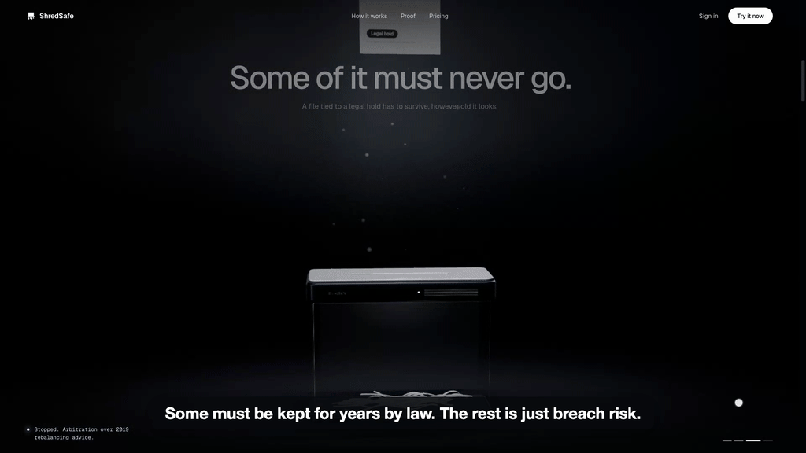](https://shredsafe.vercel.app)

</div>

## The problem

Every broker-dealer and advisory branch accumulates unstructured records: trade confirmations, account statements,
scanned IDs, client correspondence, draft financial plans, ten-year-old emails, the odd fantasy-football spreadsheet.
Two obligations pull in opposite directions:

- **Some records must be kept.** SEC Rule 17a-4(b)/(c), FINRA Rule 4511 and Advisers Act Rule 204-2 set 3- and 6-year
  retention periods, and anything tied to litigation or an exam (a *legal hold*) must be preserved however old it is.
- **Everything else should be gone.** Past its retention date, a file full of Social Security numbers is pure breach
  risk. The amended SEC Regulation S-P (2024) requires firms to have written procedures for disposing of customer
  information.

So nobody deletes anything, because deleting the wrong file is worse than keeping everything. ShredSafe makes deleting
the right files safe, fast and provable.

## What it does

1. **Reads every file.** An advisor drops a folder in. Amazon Bedrock reads each file and works out what it is
   (statement, trade confirmation, ID scan, personal file, duplicate…), who the client is, and what personal data it holds.
2. **Applies the firm's retention rules.** A rules engine maps each file to SEC 17a-4, FINRA and Reg S-P schedules and
   recommends **Delete**, **Retain** (with a keep-until date) or **Review**. Legal holds always win.
3. **Ranks by risk.** Amazon Macie scans the files for SSNs, account numbers and birth dates; ShredSafe turns those
   counts into an exposure score so the riskiest files rise to the top of the review queue.
4. **A person approves, and the server double-checks.** Nothing is deleted automatically. An advisor approves files one
   by one or in bulk; the server refuses anything on hold, marked Retain, or still inside its retention period.
5. **A safety net, then real deletion.** Approved files sit in quarantine for a grace period (one click restores them),
   then every stored version is purged. Files that must be kept *and* are highly sensitive are locked write-once with
   S3 Object Lock.
6. **Proof for examiners.** Every action goes into a hash-chained audit log. If anyone edits an old entry, the
   integrity check fails at exactly that entry, and the certificate of disposal is blocked until it's resolved.

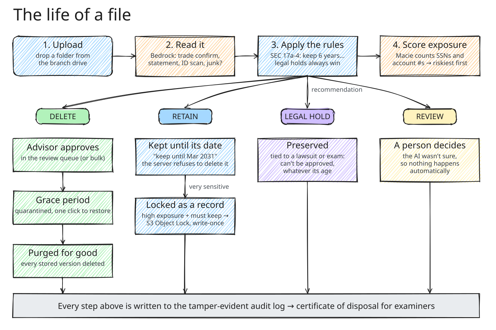

## Engineering highlights

The parts that had to be *correct*, not just work:

- **Tamper-evident ledger, safe under concurrency.** Each audit entry stores `SHA-256(prevHash + canonical JSON)`.
  Appends use a DynamoDB conditional write on the sequence number (`attribute_not_exists(seq)`): when two writers race,
  the loser re-reads the head and chains onto the winner, so the chain never forks. Reads are strongly consistent.
  Verification recomputes the chain and reports the first entry that doesn't match.
- **Invariants enforced on the server, not the client.** A record on legal hold, marked Retain, or inside its
  retention period cannot be deleted whatever the client sends (HTTP 409). Every state change is a conditional update
  on the expected current status, so two concurrent approvals can't both succeed. Bulk approval reports per-file
  results instead of failing the batch.
- **Regulation as tested code.** A rules engine maps each document type to its SEC 17a-4(b)/(c), FINRA 4511, Advisers
  Act 204-2 and Reg S-P outcome and computes the exact keep-until date; legal holds (by client, account, branch or
  keyword) override everything. Retained, high-exposure records move under S3 Object Lock (governance mode in this
  build; compliance mode is the production setting for 17a-4(f) write-once storage).
- **Fail safe, not fail open.** If classification is unsure, errors, or the file can't be read, the file becomes
  *Review* and waits for a person; nothing is ever deleted by default. A warm worker caches classifier results by the
  file's SHA-256, so an identical file isn't sent to the model twice.
- **Tenant isolation.** Each firm is a workspace; every route filters through one visibility check, and another
  firm's file returns 404 rather than 403 so IDs can't be probed. The uploader and workspace are signed into each
  presigned S3 URL, so a browser can't upload into another firm. Sign-in tokens are verified (RS256, issuer,
  audience, token use) on every request.
- **Measured, not claimed.** 247 backend tests run against faked AWS services (moto). A 1,000-file load test is
  written up with the limits it found (a 6 MB Lambda response caps one workspace at about 8–10k files) and the plan to
  page past them; a million files is estimated at about half a day and under $50 of Bedrock + Macie.

## Screenshots

| Review queue, ranked by exposure after a scan | Why a file got its recommendation |
|---|---|
| 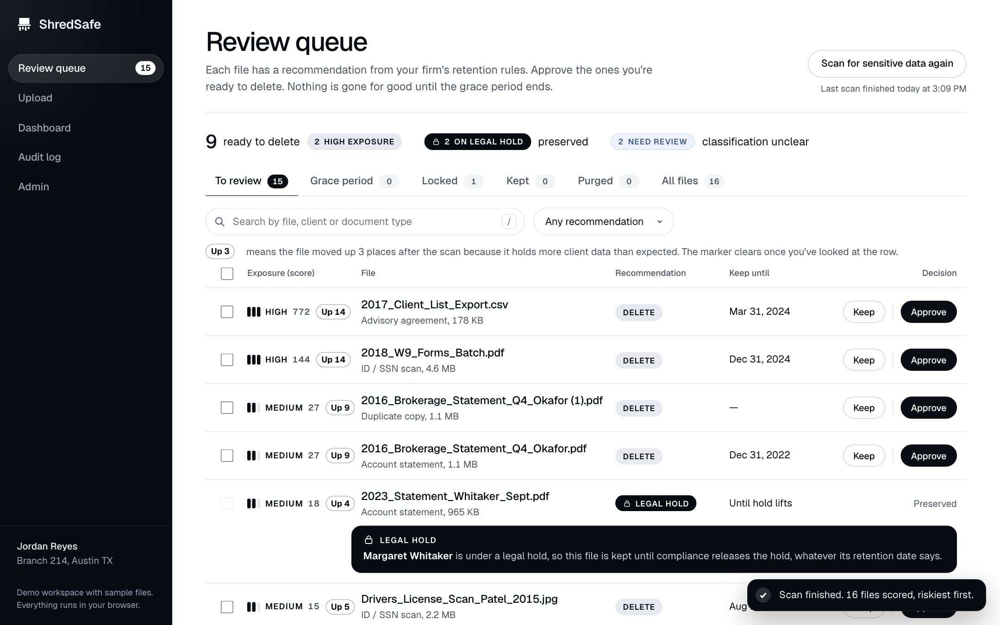 | 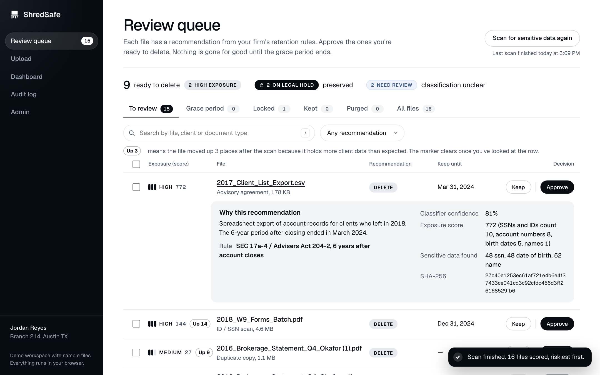 |
| **Audit log with a passing integrity check** | **…and after someone tampers with an entry** |
| 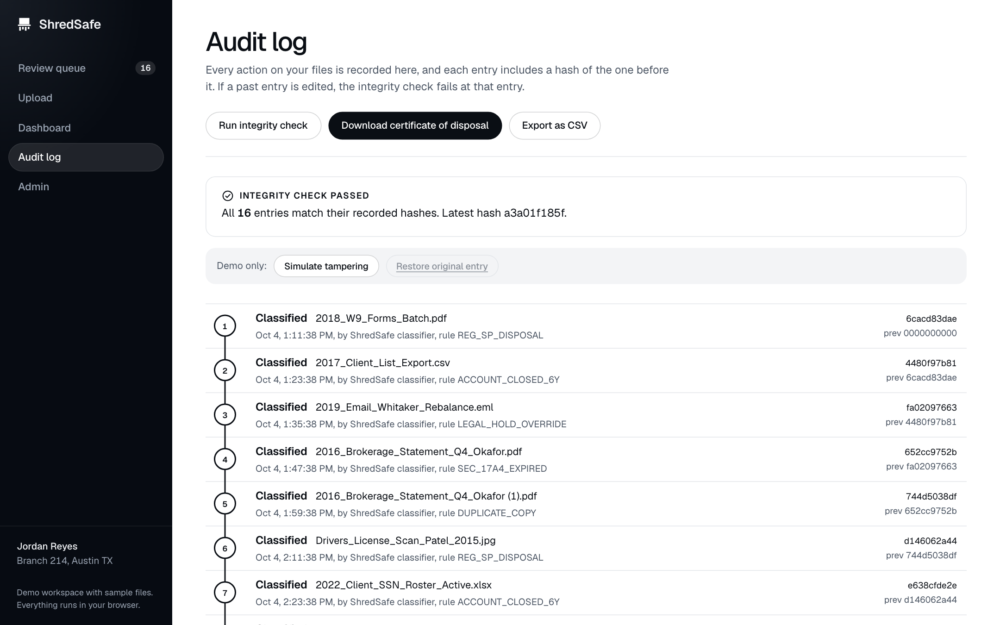 | 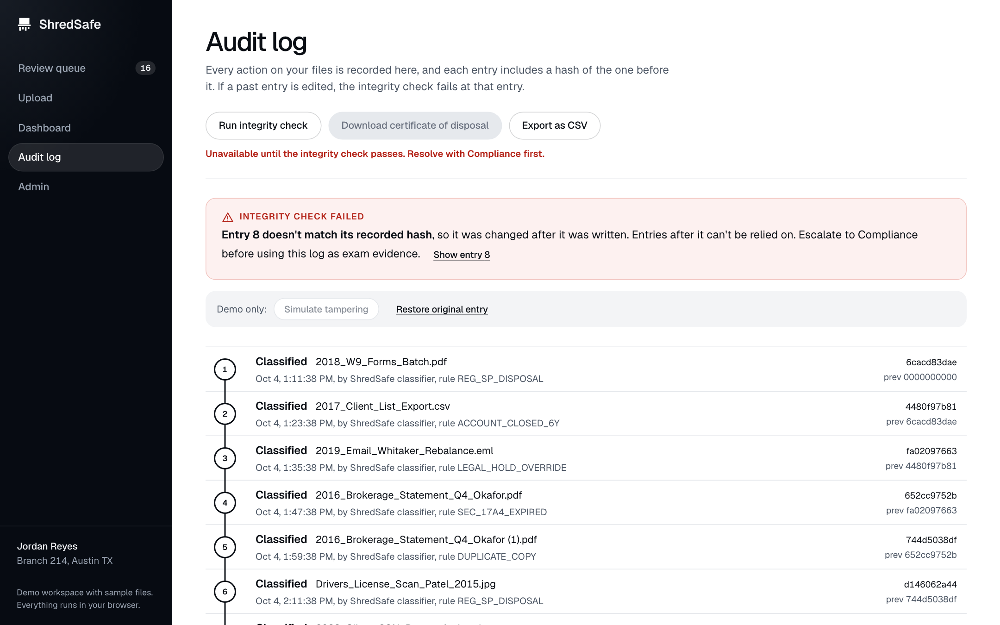 |
| **Dashboard** | **Folder upload with per-file progress** |
| 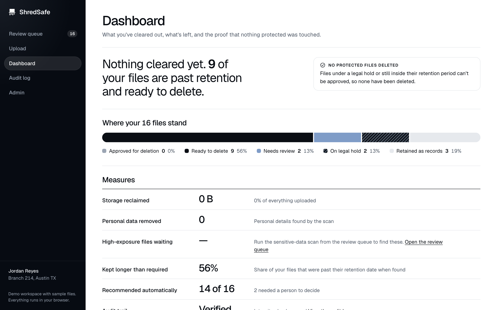 | 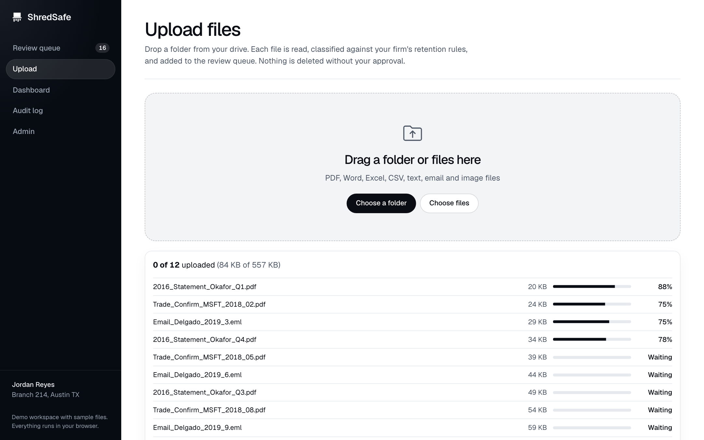 |
| **Admin: people, roles, legal holds, retention rules** | **On a phone** |
| 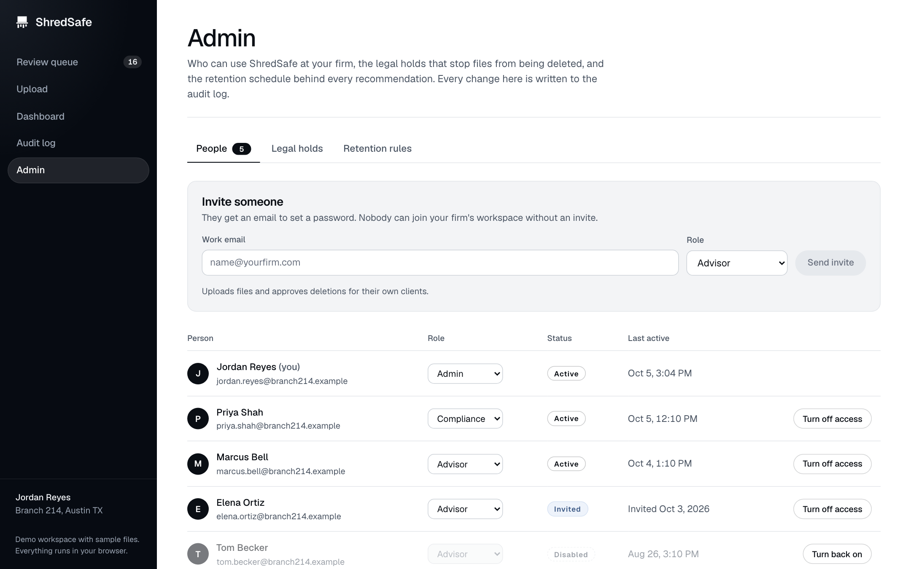 | 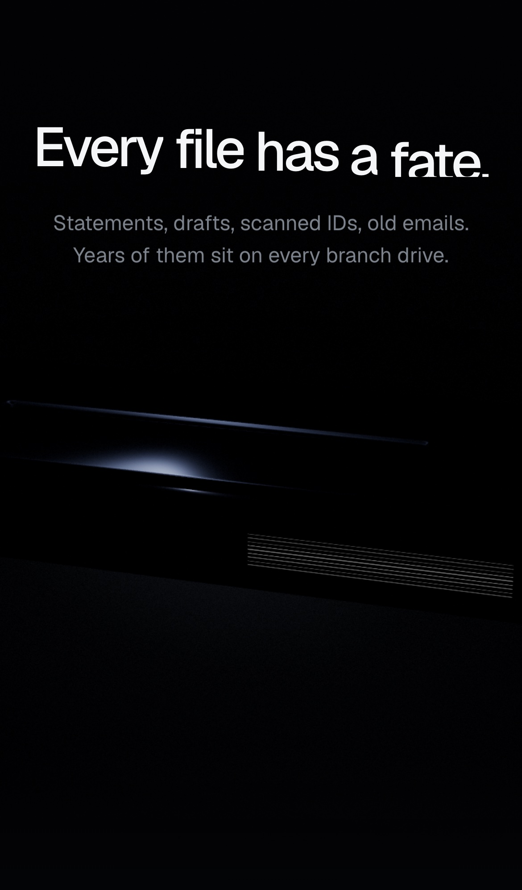 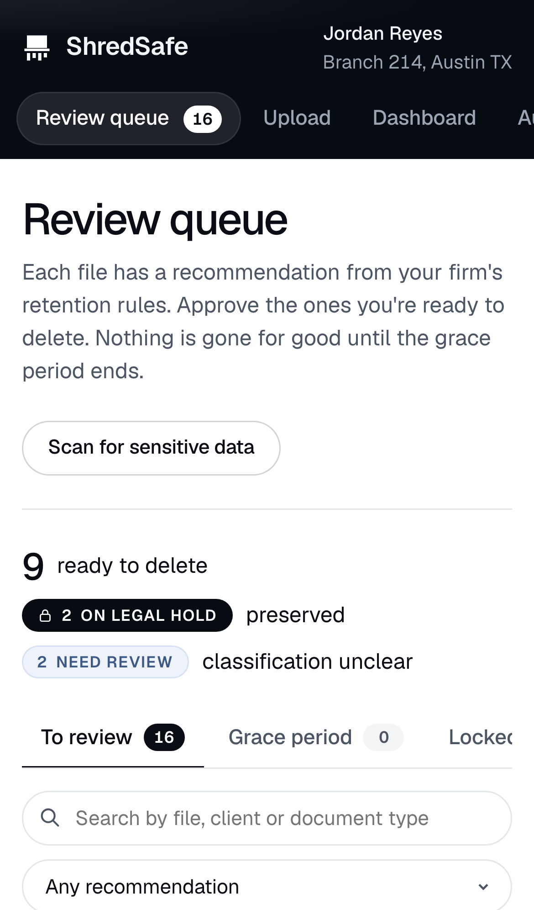 |

## How it's built on AWS

Everything is serverless and defined in one SAM template ([`infra/template.yaml`](infra/template.yaml)), deployed with
`sam build && sam deploy`.

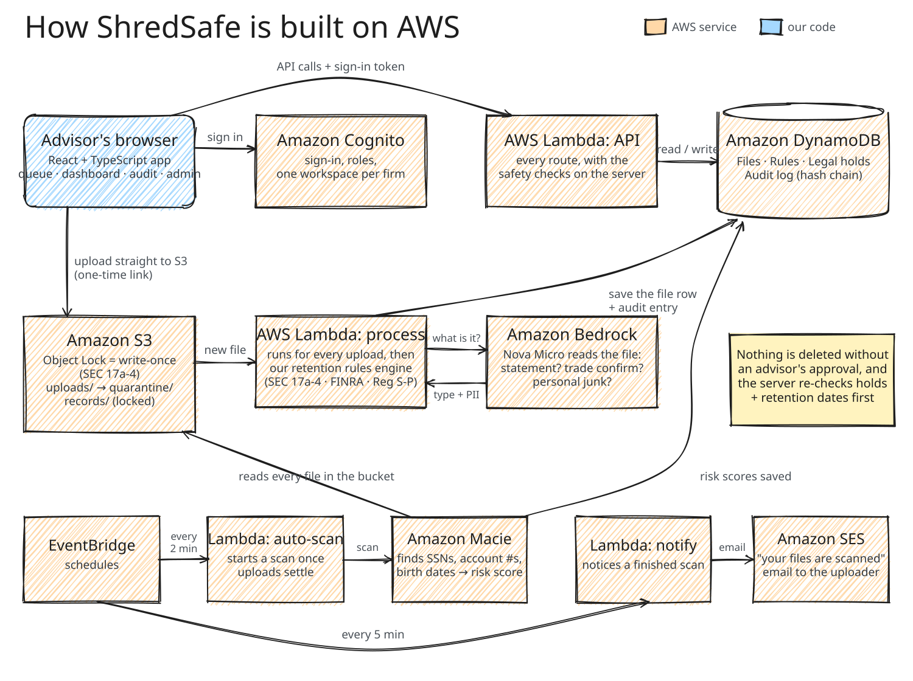

| Service | What ShredSafe uses it for |
|---|---|
| **Amazon S3** | Stores every file. **Object Lock** (write-once storage recognised for SEC 17a-4) locks records that must be kept. Folders track a file's state: `uploads/` → `quarantine/` → purged, or `records/` (locked). A lifecycle rule purges quarantine after the grace period. Browsers upload straight to S3 with one-time presigned URLs. |
| **AWS Lambda** | `process` runs for every upload (classify + apply rules). `api` serves every route behind a Function URL and enforces the safety checks. `auto-scan` and `notify` run on a schedule. A Cognito trigger gives each new sign-up their own firm workspace. |
| **Amazon Bedrock** | **Amazon Nova Micro** classifies each document and extracts the client name and the kinds of personal data in it, as structured JSON. |
| **Amazon Macie** | Scans the bucket for SSNs, account numbers, birth dates and names. The counts become each file's exposure score; high-exposure files that must be kept are locked automatically. |
| **Amazon DynamoDB** | Four tables: `Files`, `RetentionRules`, `LegalHolds` and the hash-chained `AuditLog`. |
| **Amazon Cognito** | Sign-up with email verification, sign-in and password reset. Groups give roles (advisor, compliance, admin); a workspace attribute keeps each firm's files separate. |
| **Amazon SES** | Emails each uploader a summary when their files have been scanned and are ready for review. |
| **Amazon EventBridge** | Runs the auto-scan (every 2 minutes, once uploads settle) and the notification check (every 5 minutes). |
| **IAM** | Each function can only touch the tables, bucket folders and services it needs. |

## The tamper-evident audit log

Each audit entry stores `entryHash = SHA-256(previousHash + this entry)`, so the entries form a chain. Changing a single
character in an old entry, even directly in the database, breaks the chain at that entry: the integrity check names the
entry, flags everything after it, and blocks the certificate of disposal.

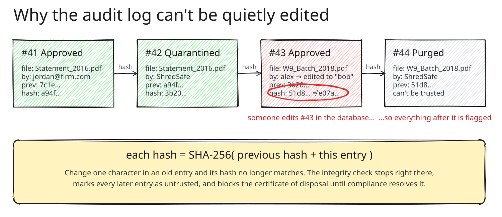

The audit page has a **Simulate tampering** button (demo only) that edits an entry the way someone with database access
would, so you can watch the check catch it.

## Other features

- **Legal holds** by client name, client ID, account, branch or keyword, including "place a hold" straight from a file.
- **Review queue** with search, filters, bulk approve, keep, restore during the grace period, and "Up 3" markers showing
  which files jumped after a scan.
- **Firm workspaces and roles:** invite teammates, change roles, turn access off; advisors never see another firm's files.
- **Automatic scanning:** the sensitive-data scan starts on its own once uploads settle, with a time estimate.
- **Exports:** the whole audit log as CSV, and a certificate of disposal as a PDF (from the backend).
- **A landing page with a real-time 3D shredder** (three.js) that tells the story as you scroll.
- **Demo mode:** the entire app also runs in the browser on sample data, which is what the hosted demo uses.

## Try it

### Run the demo on your computer (no AWS needed)

Needs Node.js 20.19+ or 22.12+.

```bash
git clone https://github.com/aryanpatel142006/shredsafe.git
cd shredsafe/frontend
npm install
npm run dev        # → http://localhost:5173
```

With no backend configured, the app runs on sample data entirely in your browser: upload files, run the
sensitive-data scan, approve and restore files, place legal holds, tamper with the audit log, and manage people.

### Deploy the demo to Vercel

The hosted demo is at **[shredsafe.vercel.app](https://shredsafe.vercel.app)**. To deploy your own copy:

[](https://vercel.com/new/clone?repository-url=https://github.com/aryanpatel142006/shredsafe&root-directory=frontend)

or import the repo at [vercel.com/new](https://vercel.com/new), set the Root Directory to `frontend`, and keep the
defaults. [`vercel.json`](vercel.json) already sets the build (`frontend/`), the output folder and the rewrite that lets
deep links like `/queue` load directly.

### Connect a real backend (optional)

The full backend needs your own AWS account (Bedrock, Macie, Cognito, SES). Deploy it with
[docs/deploy-aws.md](docs/deploy-aws.md), then give the frontend the stack's outputs as environment variables
(locally in `frontend/.env.local`, or in Vercel's project settings):

```bash
VITE_API_URL=https://<your-function-url>.lambda-url.us-east-1.on.aws
VITE_COGNITO_USER_POOL_ID=us-east-1_xxxxxxxxx
VITE_COGNITO_CLIENT_ID=xxxxxxxxxxxxxxxxxxxxxxxxxx
```

`python3 scripts/frontend_env.py --stack shredsafe` prints these for you. Set the stack's `FrontendOrigin` parameter
to your site's address so the API accepts its requests. With an API URL set, the sidebar shows a **Sample / Live**
switch.

### Run the backend tests

```bash
cd backend
python3 -m venv .venv && .venv/bin/pip install -r requirements-dev.txt
.venv/bin/python -m pytest -q      # 247 tests; AWS is faked with moto, no account needed
```

## Tech stack

| | |
|---|---|
| **Frontend** | React 19, TypeScript, Vite, React Router, Motion, three.js, Lenis, AWS Amplify (Cognito) |
| **Backend** | Python 3.11 on AWS Lambda, boto3, PyJWT |
| **AI and data** | Amazon Bedrock (Nova Micro), Amazon Macie |
| **Storage** | Amazon S3 with Object Lock, Amazon DynamoDB |
| **Infrastructure** | AWS SAM / CloudFormation, EventBridge schedules, SES, Cognito |
| **Testing** | pytest + moto (247 tests), TypeScript type-checking, oxlint |

## Project structure

```
shredsafe/
├── frontend/            React app: landing page, review queue, upload, dashboard, audit log, admin, sign-in
│   └── src/api/mock.ts  the in-browser sample backend used by demo mode
├── backend/
│   ├── api/             API Lambda: routes, audit log, legal holds, sensitivity scoring, auto-scan, emails
│   ├── process/         upload Lambda: text extraction, Bedrock classification, retention rules
│   ├── signup/          Cognito trigger: new sign-up → new firm workspace
│   └── tests/           247 pytest tests (moto fakes S3, DynamoDB, Cognito, SES)
├── infra/               SAM template + deploy settings
├── config/              retention rules and demo legal holds
├── data/                synthetic demo files (no real client data, ever) + load-test generator
├── scripts/             seeding, demo reset, user creation, email setup
└── docs/                AWS deploy guide, admin API, notifications, load testing, images
```

## Built at a hackathon

ShredSafe was built by a team of four at the **LPL Financial hackathon (October 2026)**, on an AWS sandbox the
organizers provided. That sandbox has been shut down, so the hosted version runs in demo mode; the full backend can be
deployed to any AWS account with the guide above.

**Team**

- **Aryan Patel**: the whole frontend (landing page with the 3D shredder, review queue, upload, dashboard, audit log,
  admin panel, sign-in and account pages); the hash-chained audit log, integrity check and certificate of disposal;
  restore, purge and record locking; sensitivity scoring; the admin API; scan-complete emails; server-side auto-scan;
  demo datasets and load testing.
- **Arihant Goswami**: AWS infrastructure (S3, DynamoDB, Lambdas, IAM, SAM), the core API and approval guards, the
  Macie scan integration, Cognito sign-in with firm workspaces, and deployments.
- **Anwesh Bhattarai**: Bedrock classification and text extraction, the SEC 17a-4 / FINRA retention rules engine, and
  legal-hold matching.
- **Varsha Singh**: early data models, hashing and sensitivity-scoring prototypes.

How the team split and tracked the work is in [STORIES.md](STORIES.md), [STATUS.md](STATUS.md) and
[PLAN.md](PLAN.md).

> All sample files are synthetic. ShredSafe was a hackathon project and is not legal or compliance advice.
